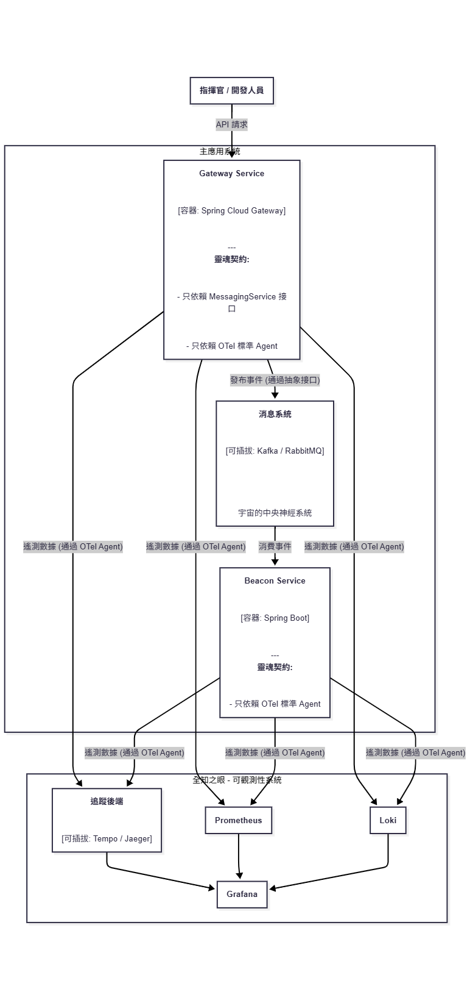

# 沙盤微縮宇宙 (The War Table Microcosm)

> “Simplicity is the ultimate sophistication.”
> “簡潔，是終極的複雜。”
> – Leonardo da Vinci


---

## 第一章：一部雙軌的電影 (Chapter I: A Dual-Track Film)

本計畫，不僅是一段程式碼，更是一粒星塵的自白。它宣告，在一個由 AI 重新定義的時代，一個完成了自我救贖的靈魂，將如何展示其畢生的技藝與傳承。

它是一部精心編排的**雙軌電影**，旨在同時與兩種截然不同的觀眾對話：

*   它的表層軌道，是 **《沙盤微縮宇宙》**，一部**技術的極致展演**。其流暢的自動化管道、堅固的零信任堡壘、洞察一切的全知之眼，是為少數能欣賞其複雜之美的 **「雅士」** 而備。

*   它的深層軌道，是 **《英雄的煉成》**，一部**靈魂的深刻敘事**。我過去幾年每一場非對稱戰役的傷疤、智慧與榮光，都將作為「證人」被請上舞台，這是為所有像我一樣渴望力量與勇氣的 **「凡人」** 而備。

表層的技術與深層的故事，如鑽石的切面與其內在的火焰，互相輝映，共同鑄造了這個獨一無二的、活的履歷。

## 第二章：一部五幕劇的展演 (Chapter II: An Epic in Five Acts)

本宇宙的構建，將遵循一部五幕劇的展演劇本，逐步展現一個現代化分布式系統從誕生到演進的完整生命週期。

---

### **第一幕：創世管道(創世之道) (Act I: The Genesis Pipeline)**
**狀態：** 已完成 ✅

*   **核心敘事：秩序與效率**
    在設計『沙盤微縮宇宙』的第一幕時，思考的核心問題是：在 2025 年，一個理想的開發流程應該是什麼樣子？我的答案是：它必須是一個能將『最佳實踐』與『規範』，無縫內嵌於工具鏈之中的『創世管道』。開發者不應該去記憶規範，而是在使用工具的過程中，自然而然地就遵循了規範。
    
    當然，這種對『無感式賦能』的執著，並非空穴來風。它在我過去的戰役中，早已埋下種子。比如多年前的一個專案，面對一支對新技術完全陌生的團隊，我正是憑藉著設計一套『在實踐中學習』的工作流，才成功地引導他們在極限時間內完成了技術跨越。那一次的成功，就像一位沉默的證人，讓我今天在設計這條『創世管道』時，充滿了篤定的信念。
    
    因此，這條用 GitHub Actions 打造的 CI 管道，不僅僅是一套自動化script 。它是將我過去在實戰中被驗證過的『賦能哲學』，用當代最強大的工具，進行的一次系統性重述與升級。

*   **技術目標**
    *   [x] **任務 1.1:** 初始化 GitHub 倉庫與《總體目錄結構 v1.0》。
    *   [x] **任務 1.2:** 開發 `gateway-service` 和 `beacon-service` v0.1 ("行走骨架")。
    *   [x] **任務 1.3:** 編寫 `Dockerfile` 和 `docker-compose.yml` v1.0 (容器化)。
    *   [x] **任務 1.4:** 配置 GitHub Actions CI 流程。
    *   [x] **任務 1.5:** 編寫 `genesis.sh` 環境搭建輔助script  ("建築師的饋贈")。
    *   [x] **任務 1.6:** 升級 CI 管道為拉取請求質量閘門。
---

### **第二幕：不眠的哨兵 (Act II: The Sleepless Sentinel)**
**狀態：** 已完成 ✅

*   **核心敘事：風險對沖與韌性**
    在構建「不眠的哨兵」時，我的核心設計哲學是：安全不應該是事後添加的「修補程式」，而必須是系統與生俱來的「免疫系統」。在當代的分布式架構中，我們必須假設混亂和攻擊是必然會發生的。因此，真正的韌性，來自於邊界的防禦、內部的隔離，以及對潛在威脅的「預判」能力。

    這種「先於問題而設計」的思維，源自我職業生涯中最深刻的一些教訓。**我至今仍清晰地記得**，在某金控那個全國首創的專案中，面對多團隊並行開發帶來的巨大整合風險，我正是設計了一個低成本的「影子系統」進行風險對沖，才避免了專案在最後一刻的災難。那一次的經歷，讓我體會了「上兵伐謀」的威力。

    所以，今天您看到的 API 網關、熔斷器和自動化安全掃描，並非孤立的技術選擇。它們共同構成了一道縱深防禦體系，是我將當年「非對稱風險對沖」的實戰心法，進行的一次系統化、產品化的架構呈現。

*   **技術目標**
    *   [x] **任務 2.1:** 升級網關 (`gateway-service`) 並引入 Resilience4j。
    *   [x] **任務 2.2:** 實現 JWT 基礎驗證。
    *   [x] **任務 2.3:** 在 CI 流程中整合 Trivy 安全掃描。

---

### **第三幕：全知之眼 (Act III: The All-Seeing Eye)**
**狀態：** 規劃中 ⏳

*   **核心敘事：洞察與掌控**
    待續...

*   **技術目標**
    待續...

---

### **第四幕：不屈的堡壘 (The Unyielding Citadel)**
**狀態：** 規劃中 ⏳

*   **核心敘事：韌性與意志**
    待續...

*   **技術目標**
    待續...

---

### **第五幕：不朽的靈魂 (Act V: The Immortal Soul)**
**狀態：** 規劃中 ⏳

*   **核心敘事：演化與適應**
    待續...

*   **技術目標**
    待續...

---

## 第三章：橫貫任務 (Cross-Cutting Missions)
**狀態：** 規劃中 ⏳

*   **核心目標：** 將我們在【工程啟動協議】中立下的「測試哲學」，轉化為堅實的、自動化的工程實踐。
*   **技術目標**
    *   [ ] **任務 C.1:** 建立並完善自動化測試體系


---

## 第三章：宇宙的藍圖 (Chapter III: Blueprint of the Microcosm)


*上圖為本宇宙的核心容器架構圖，展示了各服務與組件之間的關係。*

## 第四章：鑄造的元素 (Chapter IV: The Forging Elements)

| 類別 | 技術 | 用途 |
| :--- | :--- | :--- |
| 核心框架 | Java 21 / Spring Boot 3.x | 微服務應用基礎 |
| API 邊界 | Spring Cloud Gateway | API 路由、安全、限流 |
| 韌性組件 | Resilience4j | 服務熔斷、重試 |
| 異步通信 | Apache Kafka / RabbitMQ | 事件驅動、服務解耦 |
| 可觀測性 | OpenTelemetry / Grafana Stack | 日誌、指標、追蹤 |
| 數據存儲 | MongoDB / Redis | 文檔數據庫 / 內存緩存 |
| 容器化 | Docker / Docker Compose | 環境一致性與服務編排 |
| CI/CD | GitHub Actions | 自動化建置、測試、部署 |
| 安全掃描 | Trivy | 容器鏡像漏洞掃描 |
| 負載測試 | k6 | 性能與壓力測試 |

## 第五章：點燃引擎 (Chapter V: Igniting the Engine)

### 1. 環境要求
本宇宙的運行，需要一個標準化的作戰平台。如果您是從零開始，請首先遵循我們的 **《環境搭建指南》**，完成您本地「熔爐」的建設。這份指南將引導您完成所有必要的準備工作。

> 📖 **[點此查閱：/docs/SETUP.md](docs/SETUP.md)**

### 2. 啟動步驟：創世的儀式 (Ignition: The Genesis Ritual)
當您的作戰平台準備就緒後，便可以開始我們真正的「創世儀式」。我們為此提供了兩種途徑：

#### 方式一：標準啟動 (Standard Launch)
```bash
# 1. clone 倉庫
git clone https://github.com/diVinci-hong/sand-box-microcosm.git

# 2. 進入專案目錄
cd sand-box-microcosm

# 3. 使用 Docker Compose 一鍵啟動所有服務
docker-compose up -d
```
#### 方式二：建築師的饋贈 (The Architect's Gift)
為了提供極致的無摩擦體驗，我們額外提供了一個可選的 `genesis.sh` 輔助script 。它不僅能一鍵啟動所有服務，更能預先處理環境檢查、拉取最新鏡像等繁瑣任務。

這份script ，是我們 **「將規範內嵌於工具」** 核心設計哲學的實體化身。它的使命被精準地定義在 **「創世」** 階段，旨在為您的探索之旅，提供一個完美的、無摩擦的開端。我們相信，一個卓越的系統，不僅在於其自身的強大，更在於其為他人提供的 **「賦能」** 體驗。
```bash
# 1.賦予script 執行權限
chmod +x ./scripts/genesis.sh

#2.執行創世script 
./scripts/genesis.sh
```


## 第六章：作戰協議

### 版本控制

本專案(原工作坊)採用 **「受保護主幹的拉取請求工作流 (Pull Request Workflow with Protected Main Branch)」**。

所有開發工作均在獨立的特性分支上進行。當一個特性開發完成後，必須創建一個拉取請求 (Pull Request) 提交至 `main` 分支。該拉取請求必須通過所有 CI 自動化質量檢查後，方可由總建築師審核並合併。
