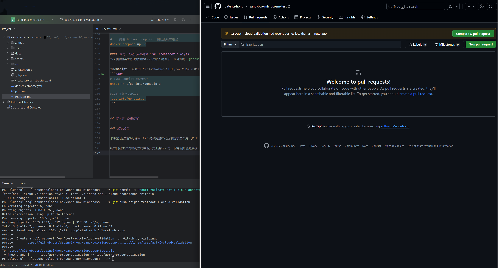
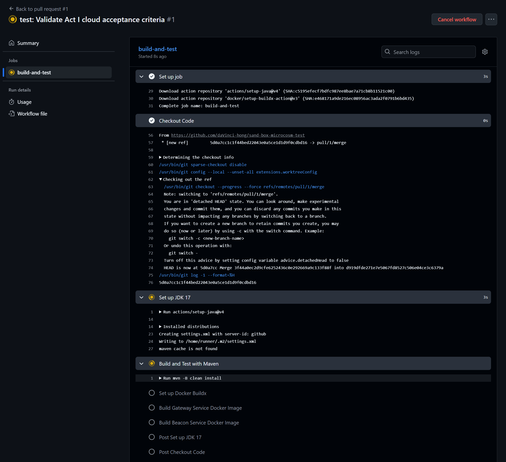
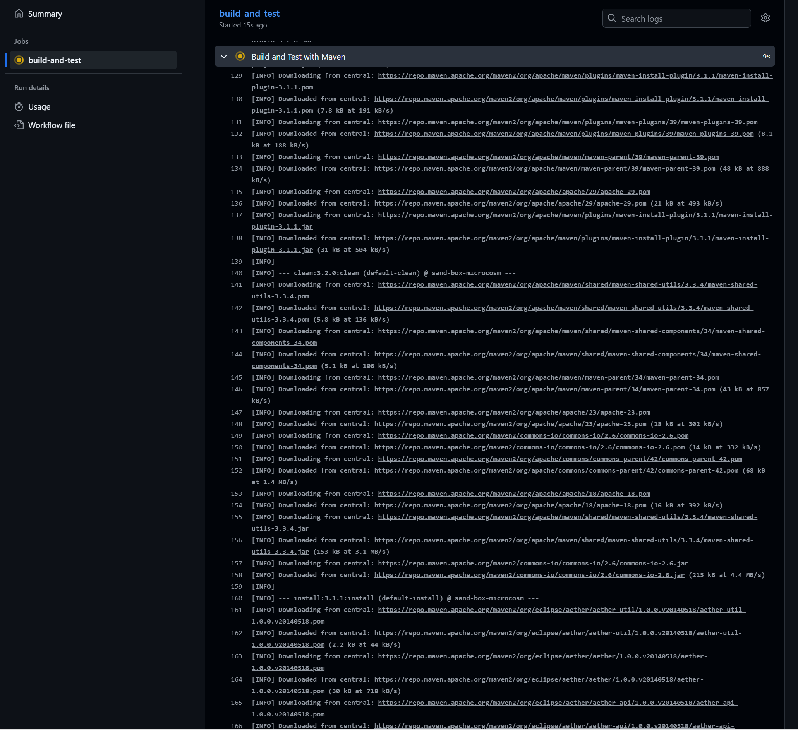
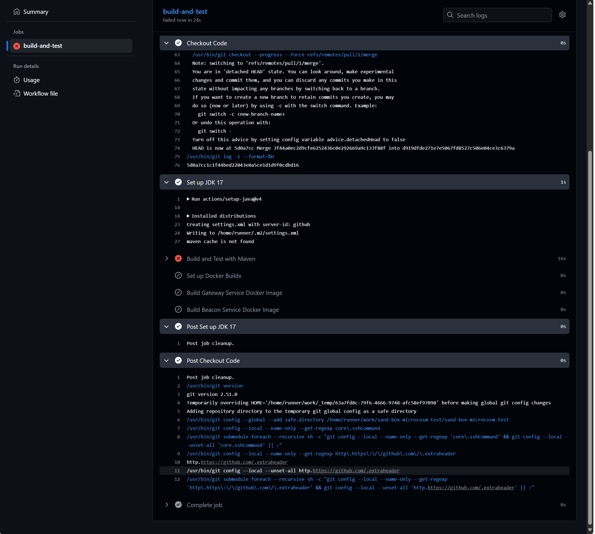
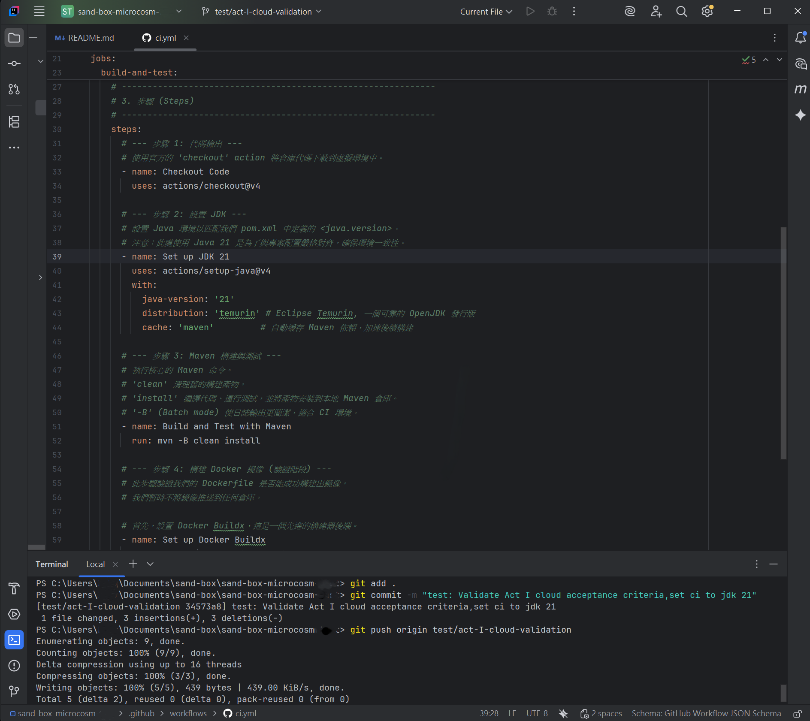
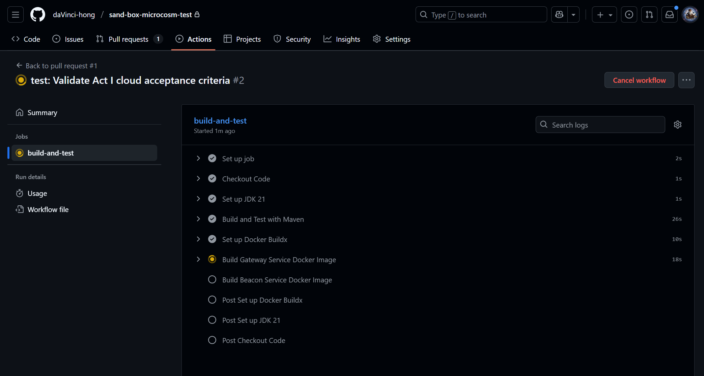
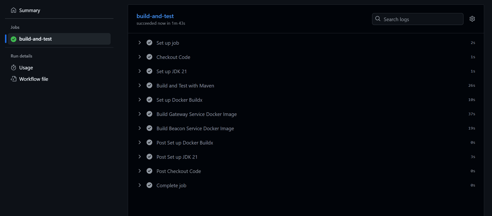
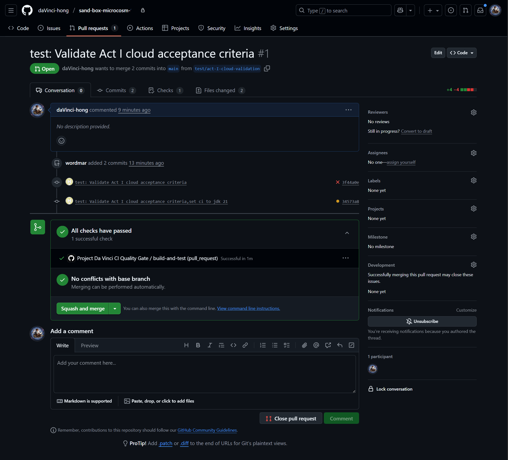
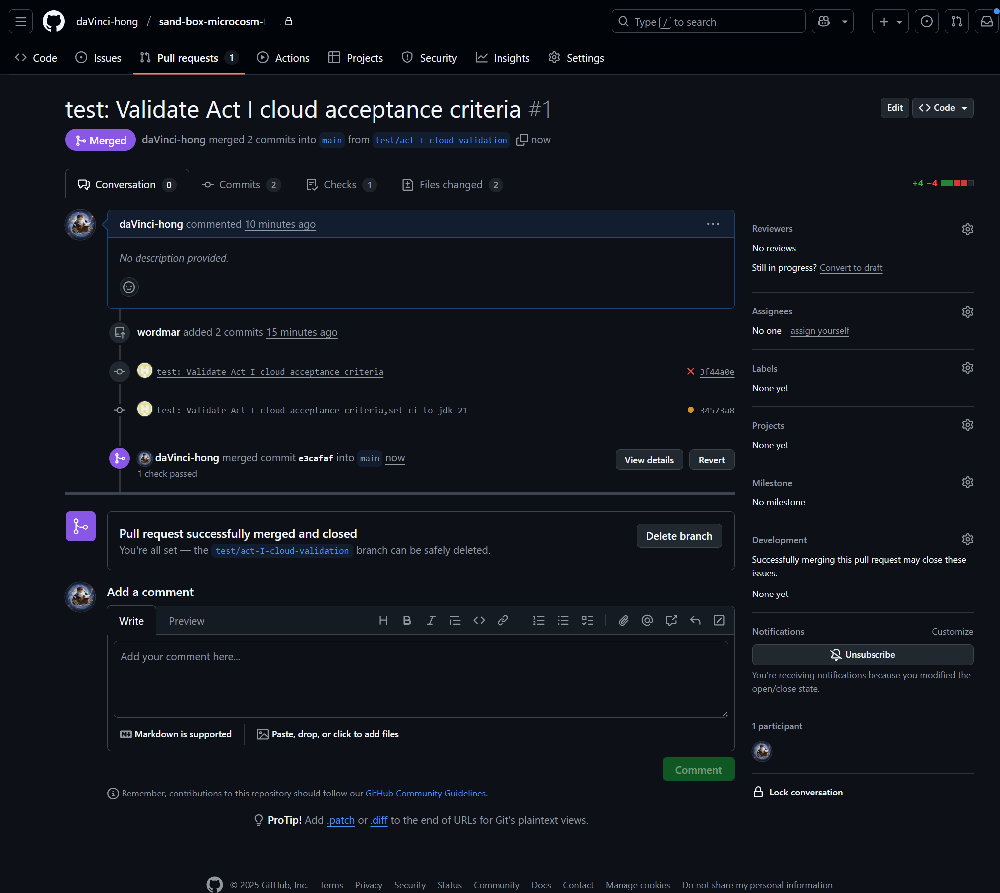
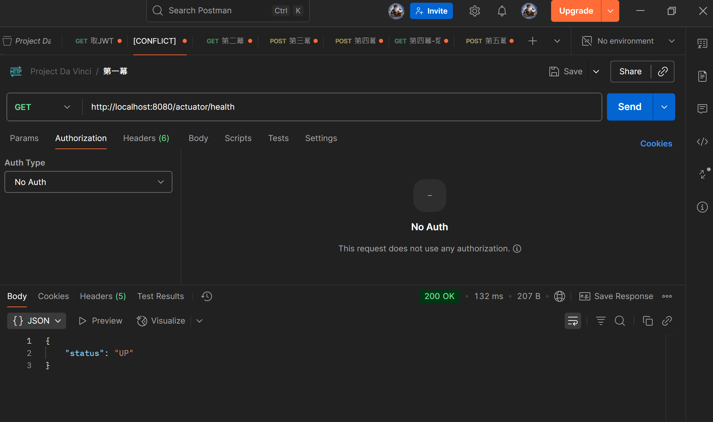

# 第一幕：創世管道 - 雲端驗收測試報告

本報告記錄了對「第一幕：創世管道」雲端驗收條件的完整測試流程，旨在驗證分支保護與質量閘門的有效性。

---

## 第一階段：首次嘗試與預期失敗

### 步驟 1：創建 PR 並觸發 CI
**內容：** 在本地創建 `test/act-I-cloud-validation` 分支，修改 `README.md` 後推送，並在 GitHub 上創建 Pull Request。

### 步驟 2：CI 自動執行
**內容：** CI/CD 管道根據 `.github/workflows/ci.yml` 的定義，自動觸發 `build-and-test` 作業。

### 步驟 3：Maven 構建過程
**內容：** CI 流程進入 "Build and Test with Maven" 階段，開始下載依賴並執行構建。

### 步驟 4：CI 失敗
**內容：** 由於 `ci.yml` 中 JDK 版本（17）與專案 `pom.xml` 中要求的版本（21）不匹配，Maven 構建失敗，CI 流程中斷。這證明了我們的質量閘門，能夠，有效地，攔截，配置錯誤。

---

## 第二階段：修正配置與成功驗證

### 步驟 5：修正 CI 配置文件
**內容：** 在本地編輯 `.github/workflows/ci.yml`，將 `setup-java` 步驟中的 `java-version` 從 `'17'` 修正為 `'21'`，並推送更新。

### 步驟 6：CI 自動重新執行
**內容：** 新的 commit 推送至 PR 分支後，GitHub Actions 自動重新觸發 CI 管道。

### 步驟 7：CI 成功通過
**內容：** 所有步驟（包括 Maven 構建與 Docker 鏡像構建）均成功執行，CI 流程順利完成。

---

## 第三階段：合併代碼

### 步驟 8：執行 Squash and Merge
**內容：** 在 Pull Request 頁面，確認所有檢查項均已通過 (`All checks have passed`)，執行 `Squash and merge` 操作。

### 步驟 9：合併完成
**內容：** Pull Request 成功合併並關閉，特性分支可被安全刪除。

---

## 第四階段：本地最終驗證

### 步驟 10：本地服務健康檢查
**內容：** 在本地啟動宇宙後，使用 Postman 對 `gateway-service` 的健康檢查端點進行驗證，確認服務正常。

---

## 結論

本次測試成功驗證了「第一幕」的雲端驗收條件。結果表明，我們的質量閘門能夠有效攔截配置錯誤，並在修正後確保代碼的穩定性與可構建性，最終安全地合併至主幹。