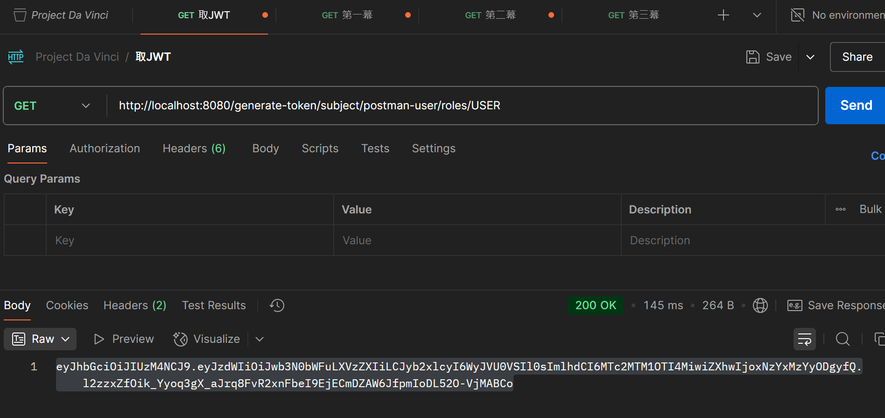
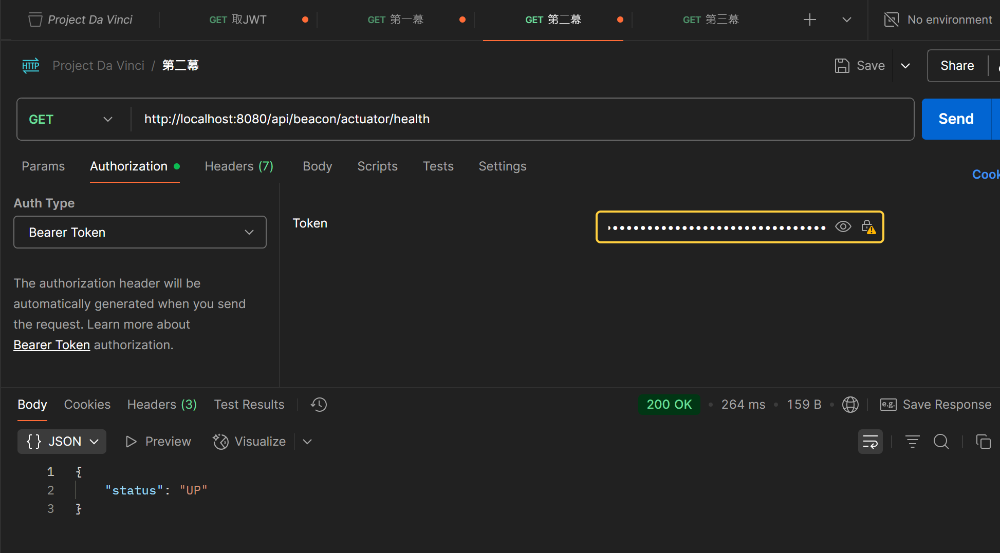

# 第二幕：不眠的哨兵 - 驗收測試報告

本報告記錄了對「第二幕：不眠的哨兵」核心功能——JWT 認證——的完整測試流程，旨在驗證 API 網關的邊界防禦能力。

---

## 第一階段：未授權訪問測試 (Unauthorized Access)

### 步驟 1：驗證「拒絕」能力
**內容：** 使用 Postman，在**不攜帶任何**認證信息的情況下，嘗試訪問受保護的端點。

**預期結果：** 請求，必須，被「認證衛兵」(`AuthenticationFilter`) 攔截，並返回 `401 Unauthorized`。

---

## 第二階段：授權訪問測試 (Authorized Access)

### 步驟 2：獲取「榮譽通行證」 (JWT)
**內容：** 訪問專為測試而設的「令牌鑄造機」端點，以獲取一枚有時效性的、包含簽名的 JWT。

### 步驟 3：驗證「放行」能力
**內容：** 將獲取的 JWT，配置在 Postman 請求的 `Authorization` -> `Bearer Token` 之中，再次訪問受保護的端點。

**預期結果：** 「認證衛兵」，必須，成功驗證令牌的有效性，並將請求安全地放行至下游服務，最終返回 `200 OK`。

---

## 結論

本次測試成功驗證了「第二幕」的核心驗收條件。結果表明，我們的「認證衛兵」，已能夠嚴格履行「永不信任，始終驗證」的核心原則，精準地區分 **「未授權的非法訪問」** 與 **「已授權的合法訪問」**。

我們的「不眠的哨兵」，已全面投入戰備狀態。