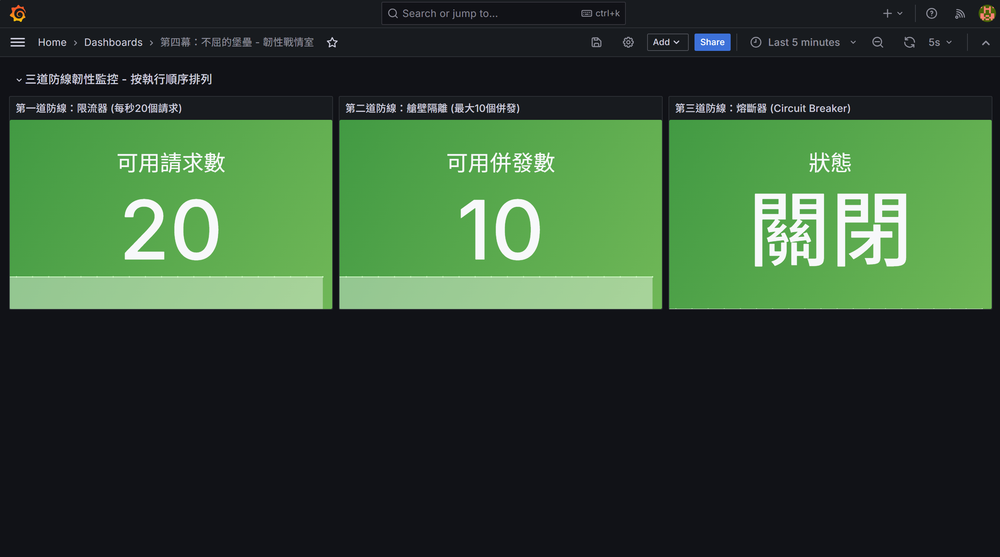
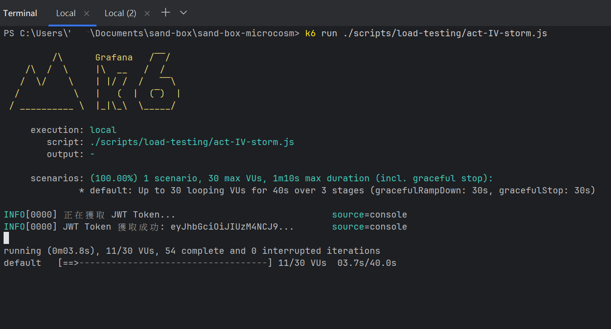
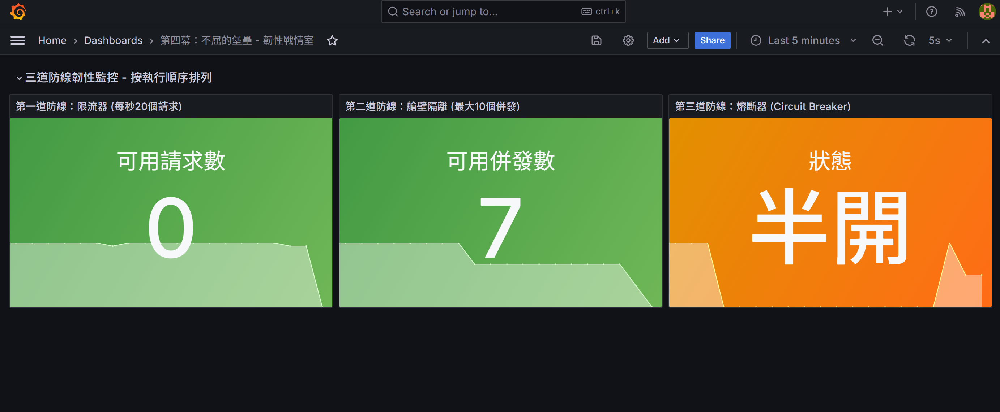
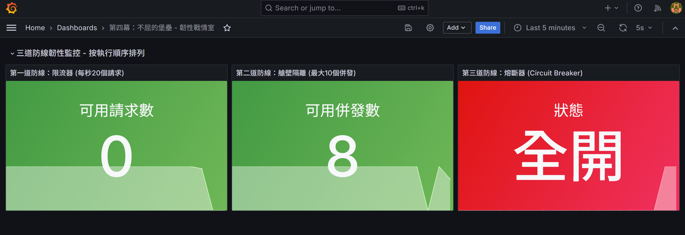
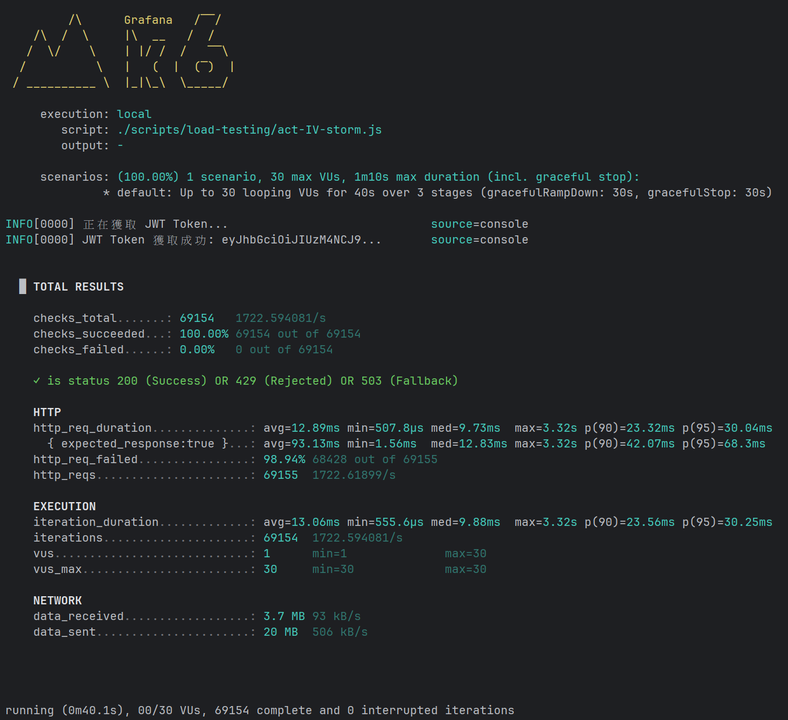

# 第四幕：不屈的堡壘 - 驗收測試報告

本報告記錄了對「第四幕：不屈的堡壘」核心功能——三位一體的韌性防禦體系——的完整實彈演習流程，旨在驗證其在「完美風暴」下的協同作戰能力。

---

## 第一階段：戰前整備 (Pre-Combat Readiness)

### 步驟 1：觀測「寧靜的防線」
**內容：** 在發起任何攻擊之前，首先，觀測「韌性戰情室」儀表板，確認所有防禦工事，均處於健康的、初始的「戰備」狀態。

**預期結果：**
*   **限流器：** 可用請求數，滿額。
*   **艙壁：** 可用併發數，滿額。
*   **熔斷器：** 狀態，為「關閉」。

---

## 第二階段：召喚「完美風暴」 (The Perfect Storm)

### 步驟 2：執行「風暴之錘」
**內容：** 執行 `k6 run ./scripts/load-testing/act-IV-storm.js` 指令，對我們的宇宙，發起一次**飽和式的、持續的**壓力打擊。

### 步驟 3：觀測「防線的協同作戰」
**內容：** 在 k6 執行期間，實時觀測「韌性戰情室」，見證我們三道防線的、教科書級別的「縱深防禦」。

**預期結果：**
*   **第一道防線 (限流器):** 在流量洪峰的第一時間，可用請求數，**斷崖式地，跌至 0**，吸收了絕大部分的攻擊。
*   **第二道防線 (艙壁):** 在併發壓力下，可用併發數，**急劇下降**，攔截了所有企圖進行飽和式打擊的突擊隊。
*   **第三道防線 (熔斷器):** 在觀測到，即使是那些成功穿透了前兩道防線的請求，也，依然，因為超時而戰死之後，狀態，從「關閉」，進入 **「半開」**。

### 步驟 4：見證「堡壘的不屈」
**內容：** 在持續的、壓倒性的攻擊之下，熔斷器，做出了最終的戰略決策。

**預期結果：** 熔斷器狀態，從「半開」，最終，變為 **「全開」**，徹底地，關閉了，整個防區，以，保護，我們宇宙的內部核心，免於崩潰。

---

## 第三階段：戰後評估 (Post-Combat Assessment)

### 步驟 5：審查「戰爭的結局」
**內容：** 審查 k6 執行完畢後的最終戰報。

**預期結果：** `http_req_failed` 的比例，**高達 98.94%**。這，不是一次失敗。這，是，我們「不屈的堡壘」，成功地，抵禦了，一場幾乎可以摧毀任何普通系統的「完美風暴」的、最為光輝的**勝利勳章**。

---

## 結論

本次測試成功驗證了「第四幕」的核心驗收條件。結果表明，我們的「三位一體」縱深防禦體系，已能夠，在實戰中，**有效地、協同地、層層遞進地**，抵禦壓倒性的負載衝擊，並，最終，通過**優雅的降級**，確保了，整個宇宙的**最終存活**。

我們的「不屈的堡壘」，名副其實。