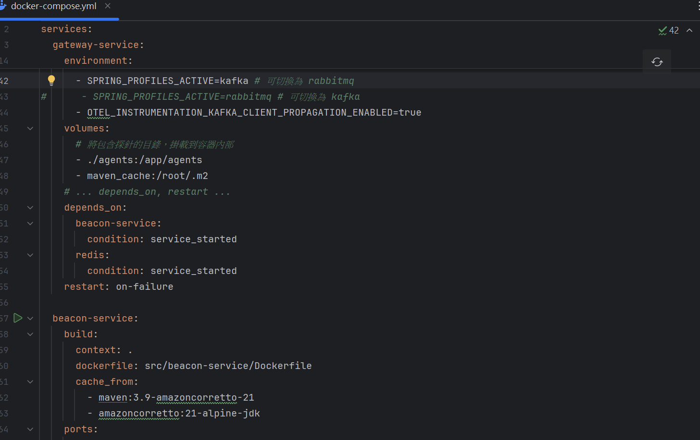
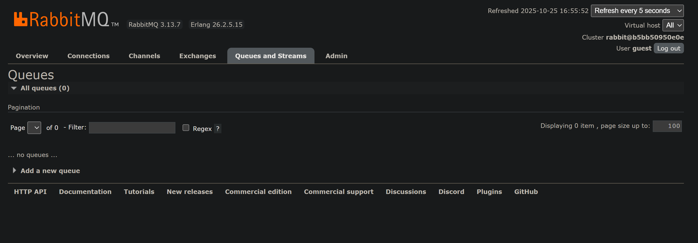
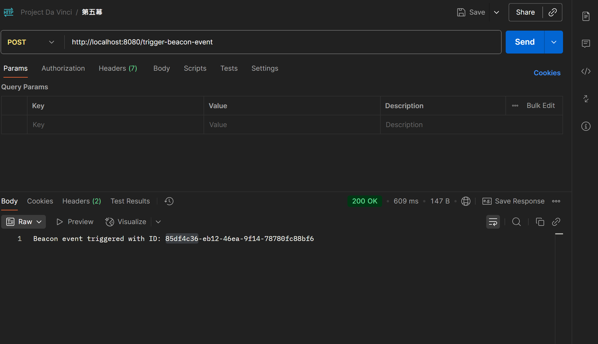
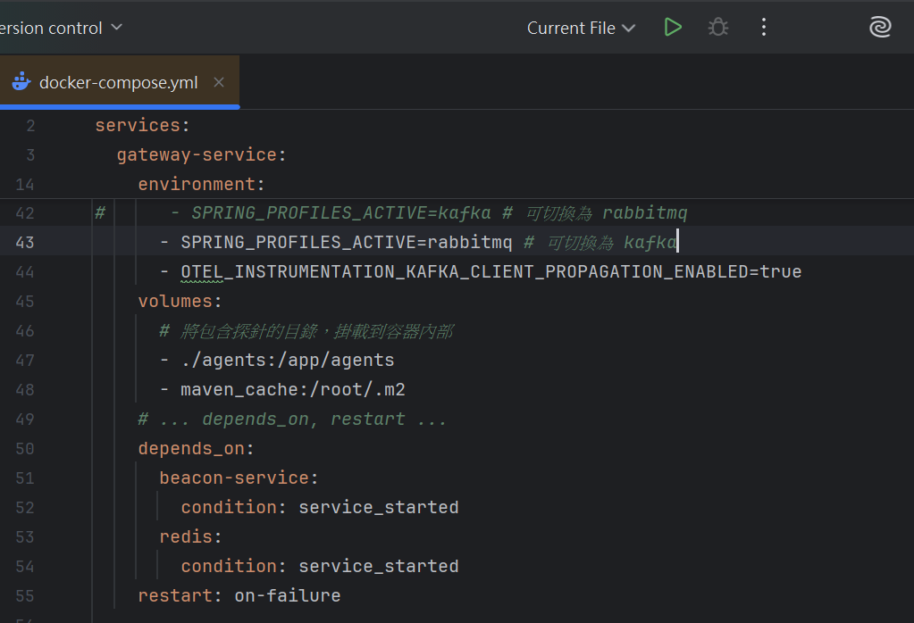
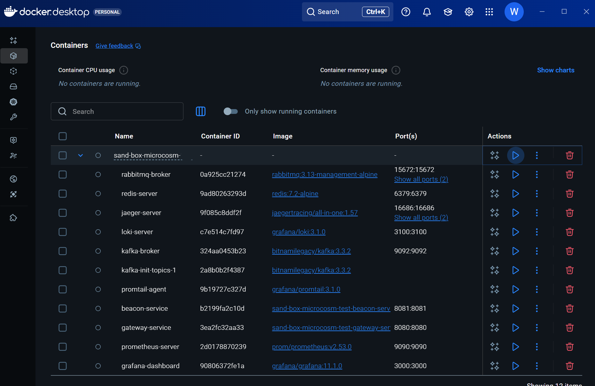
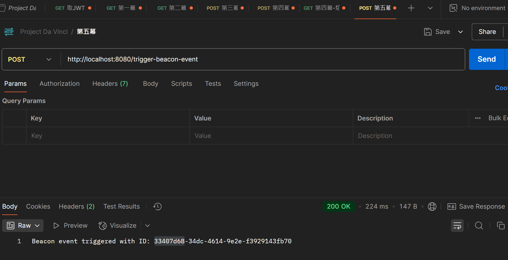
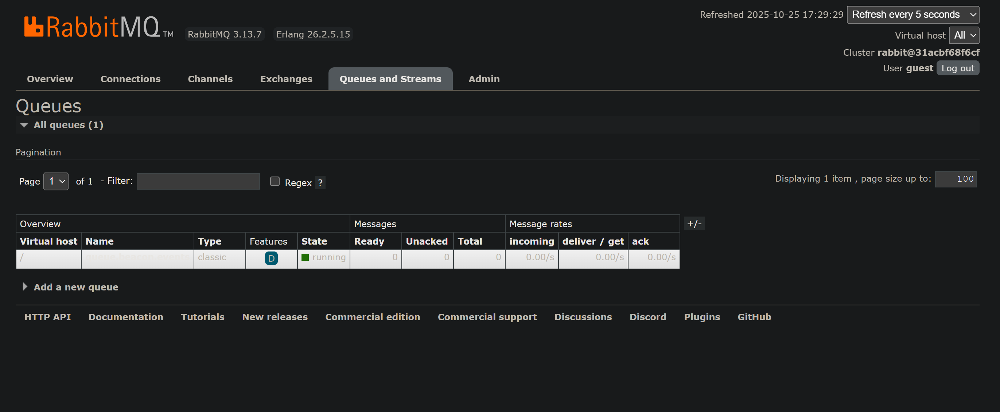
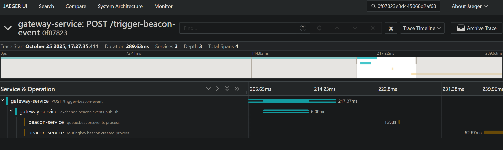

# 第五幕：不朽的靈魂 - 驗收測試報告

本報告記錄了對「第五幕：不朽的靈魂-無痛換心」核心目標——架構的可插拔性——的完整測試流程。旨在通過**僅修改基礎設施配置**，來驗證宇宙在不同「心臟」（消息中間件）與不同「眼睛」（追蹤後端）之間的無縫遷移能力。

---

## 第一階段：「卡夫卡模式」下的生命體徵檢測

### 步驟 1：配置「卡夫卡心臟」
**內容：** 在 `docker-compose.yml` 中，將所有核心服務的 `SPRING_PROFILES_ACTIVE` 環境變量，明確設置為 `kafka`。

### 步驟 2：驗證「備用心臟」的沉睡
**內容：** 訪問 RabbitMQ Management UI (`http://localhost:15672`)。

**預期結果：** Queues 列表為空。這，在物理上，證明了，在「卡夫卡模式」下，宇宙**沒有**，也**不應**，與 RabbitMQ 發生任何交互。

### 步驟 3：端到端功能驗證
**內容：** 使用 Postman，執行一次完整的「思想觸發」業務流程。

**預期結果：** 系統，在 Kafka 的驅動下，完美地，完成了事件的生產與消費，並返回了唯一的事件 ID。

---

## 第二階段：「兔子模式」下的生命體徵檢測 (心臟移植)

### 步驟 4：執行「心臟移植手術」
**內容：** 在 `docker-compose.yml` 中，將所有核心服務的 `SPRING_PROFILES_ACTIVE` 環境變量，無縫切換為 `rabbitmq`。

### 步驟 5：重啟宇宙
**內容：** 執行 `docker-compose down -v` 與 `docker-compose up --build`，以，應用，新的「心臟」。

### 步驟 6：端到端功能驗證 (術後)
**內容：** 使用 Postman，執行**完全相同**的「思想觸發」業務流程。

**預期結果：** 系統，在 RabbitMQ 的驅動下，**同樣，完美地**，完成了事件的生產與消費。

### 步驟 7：驗證「新心臟」的甦醒
**內容：** 再次訪問 RabbitMQ Management UI。

**預期結果：** Queues 列表中，已，**自動地**，出現了我們唯一的、正確的 `queue.beacon.events`。這，證明了，我們的「建築師」，已在新宇宙中，成功地，重建了「神殿」。

---

## 第三階段：「視神經移植」驗證

### 步驟 8：在新的「眼睛」中，觀測宇宙
**內容：** 在執行「兔子模式」的測試時，我們，同時，也，將追蹤後端，從 Tempo，切換為了 Jaeger。

**預期結果：** 訪問 Jaeger UI (`http://localhost:16686`)，**必須**，能夠，觀測到，那條**完整的、跨越了 RabbitMQ 的、無任何語義混淆的**因果鏈路。

---

## 結論

本次測試成功驗證了「第五幕」的核心驗收條件。結果表明，我們的宇宙，其**靈魂 (`MessagingService` 接口)**，已，**完全地，超越了**，它的**肉體 (Kafka/RabbitMQ/Tempo/Jaeger)**。

我們的宇宙，其偉大，已不再，在於它擁有何種器官。而在於，它可以，**擁有任何器官**。